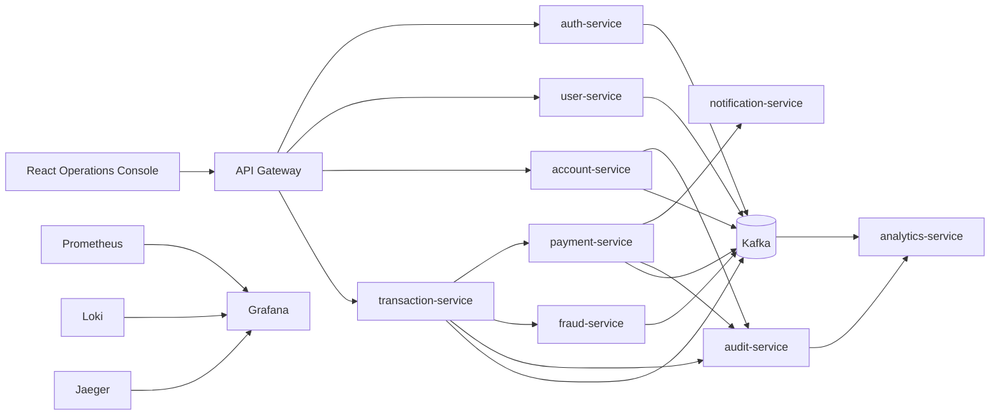

# NeoBankX Architecture

## System Shape

NeoBankX is a microservice banking platform with a security-first edge, independently owned service databases, Kafka-backed asynchronous workflows, and separate operational planes for deployment and observability.

## Service Ownership

- `api-gateway`: edge routing, rate limiting, token validation, request correlation, and perimeter security headers.
- `auth-service`: identity, credentials, refresh token rotation, session lock, and RBAC claims.
- `user-service`: customer profile, KYC state, preference management, and customer lifecycle events.
- `account-service`: account products, balances, holds, account lifecycle, and ledger boundaries.
- `transaction-service`: transaction orchestration, idempotency, saga state, and posting requests.
- `payment-service`: external payment rails, provider adapters, retries, and reconciliation hooks.
- `notification-service`: customer communication, channel preferences, templates, and delivery history.
- `fraud-service`: risk scoring, velocity checks, and suspicious activity events.
- `audit-service`: immutable audit event ingestion and query surfaces for regulated activity.
- `analytics-service`: read models, operational reporting, product metrics, and customer insights.

## Data Ownership

Services own their storage. Cross-service reads must use published APIs or projected read models. Direct database access across services is prohibited.

## Reliability Patterns

- Outbox pattern for publishing events from transactional services.
- Saga pattern for multi-step money movement.
- Dead letter topics for failed event processing.
- Idempotency keys for externally retried write requests.
- Circuit breakers and bounded retries for downstream calls.
- Correlation IDs and OpenTelemetry trace propagation across all boundaries.

## Implemented Authentication Foundation

- `api-gateway` is implemented as a Spring Cloud Gateway WebFlux service with Redis-backed rate limiting, JWT resource-server validation, correlation ID propagation, request logging, and circuit-breaker fallback for auth routes.
- `auth-service` is implemented as a Spring MVC/JPA service with BCrypt password hashing, PostgreSQL persistence, Redis token-family session markers, JWT access-token issuance, refresh-token rotation, replay protection, account lockout, and Kafka auth events.
- Secrets are runtime configuration only. `JWT_SECRET` and database passwords are not hardcoded in service code.

## Implemented Account Foundation

- `account-service` owns account lifecycle, immutable ledger postings, balance snapshots, and idempotency records in PostgreSQL.
- Account creation with an opening balance posts a balanced ledger group against the system opening account.
- Transfers update source and target balance snapshots atomically with immutable ledger entries in one transaction.
- Account and balance rows use optimistic versioning; ledger entries are protected by database triggers that reject updates and deletes.
- `api-gateway` routes `/api/v1/accounts/**` to `account-service` and requires JWT authentication.
